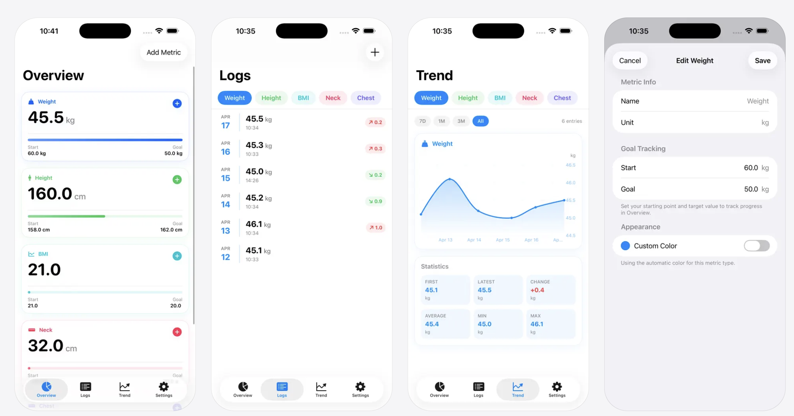

# BodyLog

A clean, modern iOS app for tracking body metrics — weight, height, body fat, measurements, and any custom metric you define.

## Available on the App Store

BodyLog is now live on the App Store: [BodyLog: Body Tracker](https://apps.apple.com/us/app/bodylog-body-tracker/id6762171840)

## Screenshots



## Features

### 4 Tabs

**Overview**
- Cards for every metric showing the current value at a glance
- Circular progress ring toward your goal when start & goal values are set
- Animated gradient progress bar from start → goal
- Quick-log button on each card — opens a sheet identical to the full Add Entry flow (value + date picker)

**Logs**
- Horizontally-scrollable chip picker scales to any number of metrics
- Each row shows date, value, and a coloured change badge (↑ red / ↓ green)
- Tap a row **or** swipe right to edit an entry
- Swipe left to delete

**Trend**
- Line + gradient area chart powered by Swift Charts
- Time-range filter: 7D / 1M / 3M / All
- Statistics grid: First, Latest, Change, Average, Min, Max

**Settings**
- Inline unit-system selector cards showing all recognised conversion pairs
- Per-metric start & goal values with live unit conversion in the edit sheet
- Custom colour picker per metric (with "Reset to Default" option)
- Full metric list with colour swatches, sortable and deletable

### Metrics

- Built-in **Weight** and **Height** with automatic metric ↔ imperial conversion
- **9 predefined templates** in the Add Metric sheet (Weight, Height, Body Fat, BMI, Waist, Hip, Chest, Neck, Arm)
- Add any fully **custom metric** with a free-text name and unit symbol
- Smart symbol detection: typing a recognised unit automatically sets the correct conversion kind

### Unit Conversion

Values are always stored in the metric unit internally. Switching unit systems converts display values on the fly — no data is changed.

| Metric unit | Imperial unit | Factor |
|---|---|---|
| kg | lbs | ×2.20462 |
| g | oz | ×0.035274 |
| m | ft | ×3.28084 |
| cm | in | ×0.393701 |
| mm | in | ×0.0393701 |

Symbols that are **not** in the table (e.g. `%`, `bpm`) are stored as-is with no conversion.

---

## Tech Stack

| Layer | Technology |
|---|---|
| UI | SwiftUI |
| Architecture | MVVM (`@Observable` + `@MainActor`) |
| Persistence | [sqlite-data](https://github.com/pointfreeco/sqlite-data) (GRDB + StructuredQueries) |
| Charts | Swift Charts (iOS 16+) |
| State | Swift Observation framework |
| Settings | UserDefaults (unit system preference) |

**Minimum deployment target:** iOS 17

---

## Project Structure

```
BodyLog/
├── App/
│   ├── BodyLogApp.swift        # Entry point, database + AppState setup
│   ├── ContentView.swift       # Root TabView
│   └── AppState.swift          # (in Libraries/Core) Global unit-system state
│
├── Database/
│   ├── AppDatabase.swift       # Schema migrations & seeding
│   └── Models/
│       ├── Metric.swift        # @Table model + BodyMetricKind + conversions
│       └── LogEntry.swift      # @Table model for individual readings
│
├── Features/
│   ├── Overview/               # OverviewView + OverviewViewModel
│   ├── Logs/                   # LogsView + LogsViewModel + Add/EditLogEntryView
│   ├── Trend/                  # TrendView + TrendViewModel (TimeRange)
│   ├── Settings/               # SettingsView + SettingsViewModel
│   │                             AddMetricView (MetricTemplate)
│   │                             EditMetricView (goals + colour picker)
│   └── Shared/
│       └── MetricChipPicker.swift
│
└── Libraries/
    └── Core/
        ├── AppState.swift      # @Observable singleton for UnitSystem
        ├── UnitSystem.swift    # Metric / Imperial enum + conversion pairs
        └── Color+Hex.swift     # Color ↔ hex-string utilities
```

---

## Getting Started

### Prerequisites

- Xcode 16+
- iOS 17 device or simulator

### Setup

1. Clone the repository:
   ```bash
   git clone https://github.com/your-username/BodyLog.git
   cd BodyLog
   ```

2. Open `BodyLog.xcodeproj` in Xcode.

3. Add the **SQLiteData** Swift package:
   - File → Add Package Dependencies…
   - Enter: `https://github.com/pointfreeco/sqlite-data`
   - Choose version **1.0.0** or later
   - Add the **SQLiteData** product to the **BodyLog** target

4. Select a simulator or device and press **Run** (⌘R).

> The project uses Xcode 16's file-system synchronised folders — all Swift files in the `BodyLog/` directory are automatically part of the build target. No manual file additions are needed.

---

## Architecture Notes

### MVVM with `@Observable`

Every screen has a dedicated `@Observable @MainActor` ViewModel. Views never write to the database directly.

```swift
@Observable
@MainActor
final class LogsViewModel {
    @ObservationIgnored
    @FetchAll(Metric.order { $0.sortOrder })
    var metrics: [Metric]
    // ...
}
```

`@ObservationIgnored` is used on `@FetchAll` properties because `sqlite-data`'s `SharedReader` already triggers SwiftUI updates independently — double-tracking would cause redundant re-renders.

### Data Flow

```
SQLite (sqlite-data)
    │  @FetchAll (reactive)
    ▼
ViewModel  ──(computed)──▶  View
    ▲
    │  database.write { ... }
    └── User action
```

### Unit Conversion

Raw values are always stored in the **metric unit**. `Metric.displayValue(_:unitSystem:)` converts for display; `Metric.rawValue(from:unitSystem:)` converts back before writing.

```swift
// Example: user enters 150 lbs, stored as kg
let raw = metric.rawValue(from: 150, unitSystem: .imperial) // → 68.04 kg
```

### Smart Symbol Inference

When a user types a unit symbol, `BodyMetricKind.infer(from:)` automatically selects the correct conversion kind so values auto-convert when the unit system changes:

```swift
BodyMetricKind.infer(from: "kg")  // → .weight
BodyMetricKind.infer(from: "cm")  // → .circumference
BodyMetricKind.infer(from: "m")   // → .meterFoot
BodyMetricKind.infer(from: "%")   // → .custom (no conversion)
```

---

## License

Copyright © Apps Bay Limited. All rights reserved.
